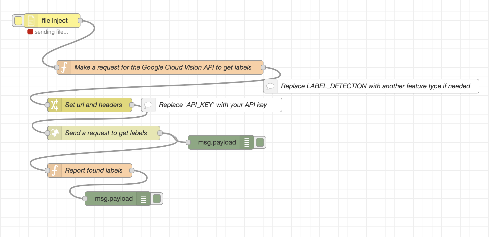

# Image understanding using Google cloud vision api with Node-RED flow
**courtesy for this flow goes to - https://flows.nodered.org/flow/4079e89b8afbcb8f70cea5d75e5120f8**

- To understand what this flow does, watch the video - [video link to be uploaded]

## Visual representaion of the flow



## JSON
```
[
    {
        "id": "b4775424.923ad8",
        "type": "tab",
        "label": "Cloud-Vision",
        "disabled": false,
        "info": ""
    },
    {
        "id": "2eff6fea.0fc58",
        "type": "http request",
        "z": "b4775424.923ad8",
        "name": "Send a request to get labels",
        "method": "POST",
        "ret": "obj",
        "url": "",
        "x": 280,
        "y": 460,
        "wires": [
            [
                "d8950b07.fd9698",
                "6dd24ca6.4a2df4"
            ]
        ]
    },
    {
        "id": "b990a8a7.acd6e8",
        "type": "function",
        "z": "b4775424.923ad8",
        "name": "Make a request for the Google Cloud Vision API to get labels",
        "func": "var image = {content: msg.payload.toString('base64')};\nvar features = {type: 'LOGO_DETECTION', maxResults: 10};\nvar imageContext = {languageHints: 'ja'};\nvar request = {image: image, features: features, imageContext: imageContext};\nvar requests = {requests: request};\nmsg.payload = requests;\n\nreturn msg;",
        "outputs": 1,
        "noerr": 0,
        "initialize": "",
        "finalize": "",
        "x": 400,
        "y": 320,
        "wires": [
            [
                "c16d905.25e967"
            ]
        ]
    },
    {
        "id": "c16d905.25e967",
        "type": "change",
        "z": "b4775424.923ad8",
        "name": "Set url and headers",
        "rules": [
            {
                "t": "set",
                "p": "url",
                "pt": "msg",
                "to": "https://vision.googleapis.com/v1/images:annotate?key=[API_KEY]",
                "tot": "str"
            },
            {
                "t": "set",
                "p": "headers",
                "pt": "msg",
                "to": "Content-Type: application/json",
                "tot": "str"
            }
        ],
        "action": "",
        "property": "",
        "from": "",
        "to": "",
        "reg": false,
        "x": 250,
        "y": 400,
        "wires": [
            [
                "2eff6fea.0fc58"
            ]
        ]
    },
    {
        "id": "d8950b07.fd9698",
        "type": "function",
        "z": "b4775424.923ad8",
        "name": "Report found labels",
        "func": "// To skip messages like { \"responses\": [ {} ] }\nif (Object.keys(msg.payload.responses[0]).length < 1) {\n    return null;\n}\n\nvar labels = 'labels: ';\nvar labelAnnotations = msg.payload.responses[0].labelAnnotations;\nfor (var i = 0; i < labelAnnotations.length; i++) {\n    labels += labelAnnotations[i].description;\n    labels +=' (' + labelAnnotations[i].score + '), ';\n}\n\nmsg.payload = labels.slice(0, labels.length - 2);\nreturn msg;",
        "outputs": 1,
        "noerr": 0,
        "x": 250,
        "y": 540,
        "wires": [
            [
                "a6e69d94.bd809"
            ]
        ]
    },
    {
        "id": "52de210b.57645",
        "type": "comment",
        "z": "b4775424.923ad8",
        "name": "Replace 'API_KEY' with your API key",
        "info": "",
        "x": 510,
        "y": 400,
        "wires": []
    },
    {
        "id": "39b9e997.d5a1b6",
        "type": "comment",
        "z": "b4775424.923ad8",
        "name": "Replace LABEL_DETECTION with another feature type if needed",
        "info": "",
        "x": 850,
        "y": 360,
        "wires": []
    },
    {
        "id": "a6e69d94.bd809",
        "type": "debug",
        "z": "b4775424.923ad8",
        "name": "",
        "active": true,
        "tosidebar": true,
        "console": false,
        "tostatus": false,
        "complete": "payload",
        "targetType": "msg",
        "statusVal": "",
        "statusType": "auto",
        "x": 310,
        "y": 600,
        "wires": []
    },
    {
        "id": "3f4b620c.435ede",
        "type": "fileinject",
        "z": "b4775424.923ad8",
        "name": "",
        "x": 170,
        "y": 220,
        "wires": [
            [
                "b990a8a7.acd6e8"
            ]
        ]
    },
    {
        "id": "6dd24ca6.4a2df4",
        "type": "debug",
        "z": "b4775424.923ad8",
        "name": "",
        "active": true,
        "tosidebar": true,
        "console": false,
        "tostatus": false,
        "complete": "false",
        "statusVal": "",
        "statusType": "auto",
        "x": 530,
        "y": 480,
        "wires": []
    }
]
```